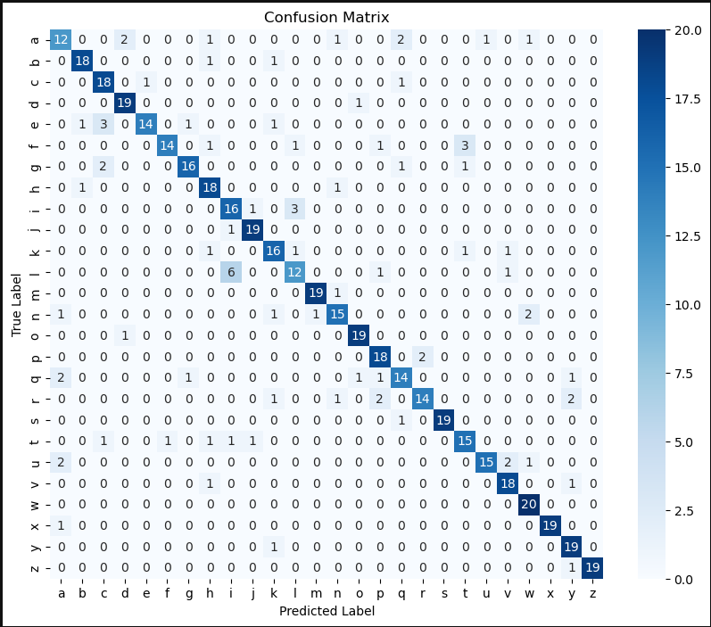
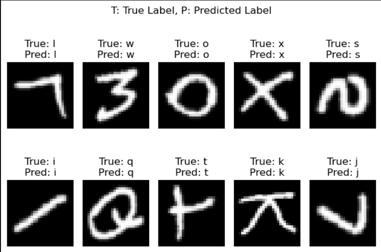

# EMNIST-Classification-with-HOG-SVM
Classification for EMNIST (Extended MNIST) Datasets using HOG (Histogram of Oriented Gradients) for feature extraction and SVM (Support Vector Machine) as Classifier. Only focuses on letter datasets.

## Overview

Project ini melakukan klasifikasi huruf pada dataset EMNIST menggunakan:

* **HOG (Histogram of Oriented Gradients)** sebagai feature extractor
* **SVM (Support Vector Machine)** sebagai model klasifikasi

Pipeline utama:

1. Dataset loading
2. Data preprocessing
3. Feature extraction menggunakan HOG
4. Training model SVM
5. Hyperparameter tuning menggunakan GridSearchCV
6. Evaluasi model
7. Visualisasi hasil prediksi

---

# Requirements

Install dependency berikut:

```bash
pip install matplotlib numpy seaborn scikit-learn scikit-image mlxtend python-mnist
```

---

# Dataset

Dataset yang digunakan:

* EMNIST Letters Dataset

Struktur folder:

```text
project/
│
├── datasets/
│   ├── emnist-letters-train-images-idx3-ubyte
│   └── emnist-letters-train-labels-idx1-ubyte
│
├── emnist_classification.py
└── README.md
```

---

# Feature Extraction

Feature extraction menggunakan:

* Orientations = 8
* Pixels per cell = (4,4)
* Cells per block = (2,2)

HOG digunakan untuk menangkap bentuk dan pola tepi karakter huruf.

---

# Classification

Model klasifikasi menggunakan:

* Support Vector Machine (SVM)

Hyperparameter tuning dilakukan menggunakan:

* GridSearchCV

Parameter yang diuji:

```python
param_grid = {
    'C': [0.1, 1, 10],
    'kernel': ['linear', 'rbf', 'poly'],
    'gamma': ['scale', 'auto']
}
```

---

# Evaluation

Evaluasi model menggunakan:

* Accuracy Score
* Classification Report
* Confusion Matrix

---

# Python Program

```python
import numpy as np
import matplotlib.pyplot as plt
import seaborn as sns
import random

from skimage.feature import hog
from sklearn.model_selection import train_test_split, GridSearchCV
from sklearn.svm import SVC
from sklearn.metrics import accuracy_score, classification_report, confusion_matrix
from mlxtend.data import loadlocal_mnist

# =========================
# DATASET LOADING
# =========================

print("Loading dataset...")

images_path = "datasets/emnist-letters-train-images-idx3-ubyte"
labels_path = "datasets/emnist-letters-train-labels-idx1-ubyte"

X, y = loadlocal_mnist(
    images_path=images_path,
    labels_path=labels_path
)

print("Total images:", len(X))
print("Total labels:", len(y))

# Label adjustment
# EMNIST letters starts from label 1
# Convert to 0-25

y = y - 1

# =========================
# DATA SUBSETING
# =========================

X = np.array(X)
y = np.array(y)

selected_img = []
selected_labels = []

samples_per_class = 1000

for class_idx in range(26):
    idx = np.where(y == class_idx)[0][:samples_per_class]
    selected_img.extend(X[idx])
    selected_labels.extend(y[idx])

X_subset = np.array(selected_img)
y_subset = np.array(selected_labels)

# =========================
# TRAIN TEST SPLIT
# =========================

X_train, X_test, y_train, y_test = train_test_split(
    X_subset,
    y_subset,
    test_size=0.2,
    random_state=42,
    stratify=y_subset
)

# =========================
# HOG FEATURE EXTRACTION
# =========================

orientations = 8
pixels_per_cell = (4, 4)
cells_per_block = (2, 2)


def hog_features(images,
                 orientations=8,
                 pixels_per_cell=(4, 4),
                 cells_per_block=(2, 2)):

    features = []

    for img in images:
        feature = hog(
            img.reshape(28, 28),
            orientations=orientations,
            pixels_per_cell=pixels_per_cell,
            cells_per_block=cells_per_block,
            visualize=False
        )

        features.append(feature)

    return np.array(features)


print("Extracting HOG features...")

X_train_hog = hog_features(
    X_train,
    orientations,
    pixels_per_cell,
    cells_per_block
)

X_test_hog = hog_features(
    X_test,
    orientations,
    pixels_per_cell,
    cells_per_block
)

# =========================
# SVM CLASSIFICATION
# =========================

param_grid = {
    'C': [0.1, 1, 10],
    'kernel': ['linear', 'rbf', 'poly'],
    'gamma': ['scale', 'auto']
}

svm = SVC()

grid_search = GridSearchCV(
    svm,
    param_grid,
    cv=5,
    n_jobs=-1,
    verbose=2
)

print("Training SVM model...")
grid_search.fit(X_train_hog, y_train)

print("Best parameters:", grid_search.best_params_)
print("Best score:", grid_search.best_score_)

best_model = grid_search.best_estimator_

# =========================
# EVALUATION
# =========================

print("Evaluating model...")

y_pred = best_model.predict(X_test_hog)

accuracy = accuracy_score(y_test, y_pred)

print("Accuracy:", accuracy)

print("\nClassification Report:\n")
print(classification_report(y_test, y_pred))

# =========================
# CONFUSION MATRIX
# =========================

c_mat = confusion_matrix(y_test, y_pred)

plt.figure(figsize=(10, 8))

sns.heatmap(
    c_mat,
    annot=True,
    fmt='d',
    cmap='Blues'
)

plt.title("Confusion Matrix")
plt.xlabel("Predicted")
plt.ylabel("Actual")
plt.show()

# =========================
# PREDICTION VISUALIZATION
# =========================

indices = random.sample(range(len(X_test)), 10)

plt.figure(figsize=(15, 6))

for i, idx in enumerate(indices):

    img = X_test[idx].reshape(28, 28)

    pred = y_pred[idx]
    actual = y_test[idx]

    plt.subplot(2, 5, i + 1)
    plt.imshow(img, cmap='gray')
    plt.title(f"P:{pred} | A:{actual}")
    plt.axis('off')

plt.tight_layout()
plt.show()
```

---

# Output

Program akan menghasilkan:

* Akurasi klasifikasi huruf
* Classification report
  
* Confusion matrix
  


  
* Visualisasi hasil prediksi huruf



---

# Conclusion

Kombinasi HOG dan SVM cukup efektif untuk klasifikasi karakter tulisan tangan karena:

* HOG mampu menangkap pola bentuk karakter
* SVM bekerja baik pada data feature vector hasil ekstraksi
* GridSearchCV membantu mencari parameter terbaik

